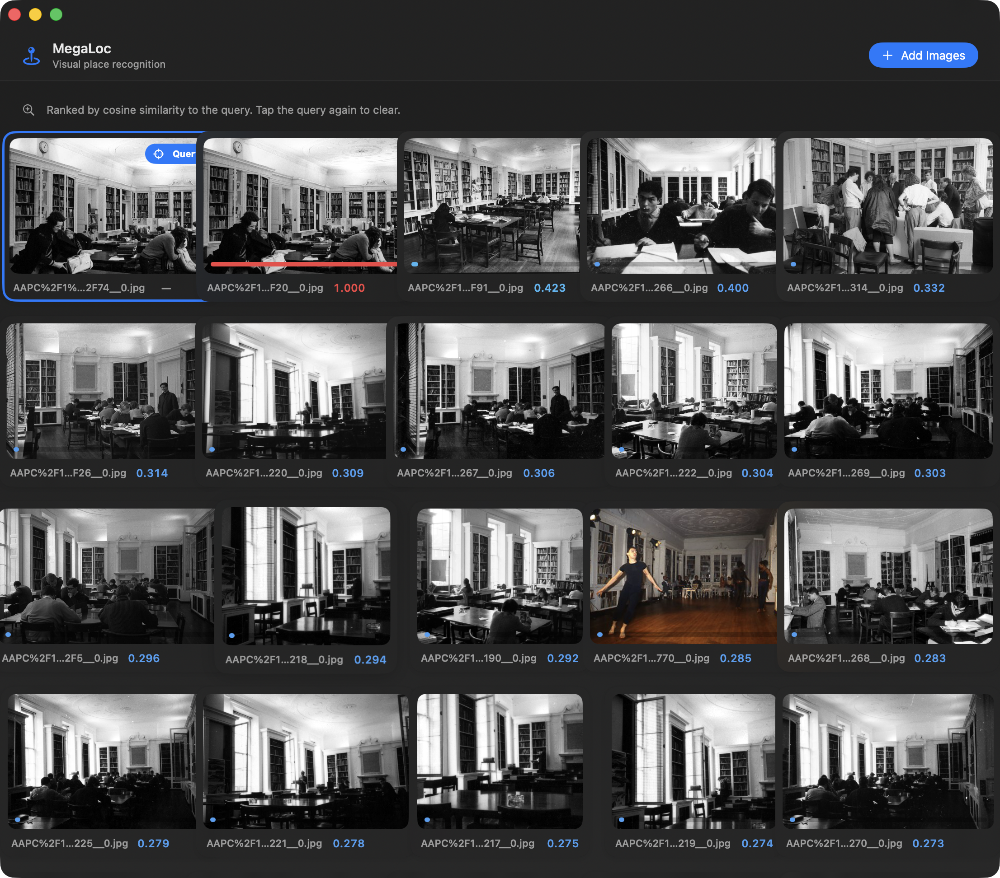

# mlx-swift-MegaLoc

A Swift / [MLX](https://github.com/ml-explore/mlx-swift) port of **MegaLoc** —
*[One Retrieval to Place Them All](https://arxiv.org/abs/2502.17237)* (Berton &
Masone, CVPRW 2025) — for visual place recognition (VPR) on Apple Silicon.

MegaLoc maps an image to a single **8448-D L2-normalised descriptor**. Two images
of the same place produce descriptors with high cosine similarity, so place
recognition / image retrieval is a nearest-neighbour search over descriptors.



<sub>The `MegaLocExample` app ranking a database by similarity to the selected
query — a different view of the same reading room scores 1.000. Demo photographs
courtesy of the AA Archives, Architectural Association.</sub>

- **Backbone**: DINOv2 ViT-B/14 (12 blocks, 768-D, patch 14)
- **Aggregator**: SALAD optimal-transport (Sinkhorn) aggregator + linear head
- **Checkpoint**: [`gberton/MegaLoc`](https://huggingface.co/gberton/MegaLoc) (228.6M params, fp32)

## Numerical parity

Verified against the reference PyTorch model (`gmberton/MegaLoc`) with per-stage
fixtures (see `Tools/generate_fixtures.py`, `Tests/MLXMegaLocTests`):

| Stage | CPU device (vs PyTorch CPU) | GPU / Metal (production) |
| --- | --- | --- |
| SALAD descriptor | max abs **1.7e-7** | 4.4e-4 |
| linear head | **5.7e-8** | 1.9e-4 |
| final descriptor | **2.1e-7** | 6.8e-4 |
| **descriptor cosine** | **1.000000** | **0.999885** |

On the CPU device MLX reproduces PyTorch to ~1e-7 — a strict correctness proof.
On the Metal GPU the only difference is fp32 matmul accumulation order, which
leaves the retrieval descriptor cosine at ≈ 0.9999 (indistinguishable for
retrieval). The larger per-element differences in the backbone are DINOv2's
known high-norm "artifact" tokens.

## Performance

MegaLoc forward pass, 322×322 input, Apple Silicon:

| Runtime | ms / image | throughput |
| --- | --- | --- |
| **MLX Swift (this port, GPU)** | **9.3 ms** | **108 img/s** |
| PyTorch (MPS) | 17.3 ms | 58 img/s |

Active GPU memory is flat across a long inference loop (no leaks); the multi-GB
peak footprint is MLX's reusable buffer cache, not a leak (`megaloc-cli bench`).

## Installation

```swift
// Package.swift
.package(url: "https://github.com/mnmly/mlx-swift-MegaLoc", from: "0.1.0")
```

## Usage

```swift
import MLXMegaLoc

// 1. Get the checkpoint (into ~/.cache/huggingface, interoperable with `hf`).
let weights = MegaLocHub.cachedModelURL() ?? (try await MegaLocHub.download())

// 2. Load once.
let session = try MegaLocSession.load(weights: weights)

// 3. Embed a database of places and a query, then rank.
let db = session.embed(urls: databaseImageURLs)          // [(url, descriptor)]
let query = session.embed(image: queryCGImage)
let matches = MegaLocSession.rank(query: query, database: db.map(\.descriptor))

let best = db[matches[0].index].url                       // most similar place
```

`MegaLocDescriptor` is a plain `Sendable` value type (`[Float]`), so it crosses
task/actor boundaries freely. The expensive network forward (`embed`) is kept
separate from cheap post-processing (`similarity` / `rank`) so a UI can re-rank
cached descriptors instantly without re-running the model.

## CLI

Built with `xcodebuild -scheme megaloc-cli -configuration Release`:

```
megaloc-cli download                          # fetch weights → ~/.cache/huggingface
megaloc-cli similarity a.jpg b.jpg            # cosine similarity (1.0 = same place)
megaloc-cli rank --query q.jpg db1.jpg db2.jpg …   # rank a database by a query
megaloc-cli embed image.jpg --out desc.json   # write the 8448-D descriptor
megaloc-cli bench --iterations 50             # forward-pass timing + leak check
```

## Example app

`Examples/MegaLocExample/` is a SwiftUI macOS app (Swift 6, strict concurrency):
tap any image to make it the query and the rest re-rank live by place
similarity. It downloads the checkpoint into `~/.cache/huggingface` (or loads an
existing copy / a file you pick) and drives the same `MegaLocSession` the CLI
uses.

```bash
open Examples/MegaLocExample/MegaLocExample.xcodeproj
```

## Building & testing

MLX needs the Metal toolchain, so use `xcodebuild`, not `swift run`:

```bash
# Tests (numerical parity — needs a local checkpoint). Runs the fast GPU
# check; the exhaustive CPU proof is opt-in (below):
xcodebuild -scheme mlx-swift-MegaLoc-Package -destination 'platform=macOS' test

# Opt in to the strict CPU-device proof (matches PyTorch to ~1e-7, but slow):
touch ~/.megaloc-run-cpu-parity        # or set MEGALOC_CPU_PARITY=1 in Xcode
xcodebuild -scheme mlx-swift-MegaLoc-Package -destination 'platform=macOS' test

# Docs (DocC static site → docs/):
BUILD_DOC=1 ./Scripts/build_docs.sh
```

## Credits

- MegaLoc: Gabriele Berton, Carlo Masone — [paper](https://arxiv.org/abs/2502.17237), [original repo](https://github.com/gmberton/MegaLoc)
- Built on [mlx-swift](https://github.com/ml-explore/mlx-swift). The SALAD +
  DINOv2 implementation reuses the parity-tested approach from `mlx-swift-da3`.
- Demo photographs (README screenshot) courtesy of the **AA Archives,
  Architectural Association**.

## License

MIT (matching the upstream MegaLoc license).
